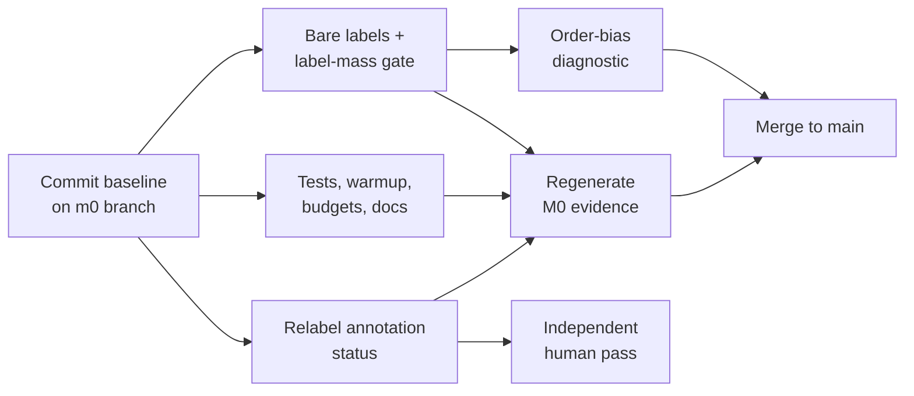

# jev-at-home M0 remediation plan

2026-09-20

## Summary

M0 passes its feasibility gate, but four issues need closing before M1 starts: off-distribution answer labels, a strong `other` bias, overstated adjudication, and missing housekeeping. Only issue 1 changes code on the scoring path. After that fix, the M0 evidence gets regenerated once, so every recorded hash comes from committed code.

The independent re-run on 2026-09-20 reproduced 0.74 accuracy and 0.752 macro-F1. The pass stands. This plan changes how the result is recorded and what M1 builds on, not the M0 verdict.

**M0 closes when:** labels hold at least 0.5 of next-token probability mass on every case, the order-bias diagnostic has been run and recorded, `M0_RESULTS.md` describes the annotation accurately, budgets and stop conditions are written down, and everything is committed with evidence regenerated from that commit.

## 1. Answer labels the model never outputs

Switch to bare labels (`A`..`P`) and add a startup check that rejects any label set holding too little probability mass. The current space-prefixed labels hold 0.000006 of next-token mass; bare labels hold 0.91 with identical argmax, so the fix costs nothing in accuracy.

| Labels | Accuracy | Mean label mass |
| --- | --- | --- |
| `" A"`..`" D"` (current) | 0.74 | 0.000006 |
| `"A"`..`"D"` (proposed) | 0.74 | 0.91 |

**Changes**

1. `src/jah/compiler.py`: change `LABELS` to bare letters and bump `PROMPT_VERSION` to `decision-prompt-v2`.
2. `configs/models/qwen3.5-4b.yaml`: update `labels` and set `label_version: latin-uppercase-bare-v2`.
3. `verify_single_token_labels` stays as is. It still guards tokenization at the boundary after `</think>\n\n`.
4. `src/jah/backends/huggingface.py`: after the forward pass, compute the full-vocabulary softmax at the final position and sum the label probabilities. Return it as `label_mass` on `InferenceMeasurement`.
5. `src/jah/compat.py`: record `label_mass` per row in `predictions.jsonl`, and add min / median label mass to the report. Fail the run with a clear error if any case falls below `minimum_label_mass`. No fallback to other labels.
6. `configs/workloads/support-routing-v1.yaml`: add `minimum_label_mass: 0.5` to the feasibility gate.

**Tests**

- A fake-logits test where label mass is below the threshold raises.
- A compiler test asserting bare labels and the v2 prompt version.

**Done when:** the regenerated `compatibility.json` shows minimum label mass at or above 0.5 and accuracy within 0.02 of 0.74.

## 2. Bias toward `other`

Run a diagnostic that separates position bias from wording bias, then record the result. Don't change the frozen prompt in M0. All 13 errors went to `other` (option D, last), 25 of 50 predictions were `other`, and `technical` recall is 0.46.

**Diagnostic runs** (a new `src/jah/diagnostics/order_bias.py`, run with bare labels from issue 1 on the same 50 cases):

| Run | Change | What it isolates |
| --- | --- | --- |
| R0 | None (baseline) | Reference |
| R1 | Cyclic rotations: each option takes each of the 4 positions | Position / letter bias |
| R2 | `other` moved to position A, rest in original order | Last-position effect on `other` specifically |
| R3 | `other` description shortened to "None of the listed teams applies." | Wording of the catch-all |
| R4 | Content-free input (state = "N/A") across all rotations | The model's prior over letters |

**Record per run:** accuracy, macro-F1, predicted-class counts, and label-aligned flip rate versus R0. For R1, also record mean probability by letter.

**Decision rule**

- If `other`'s share tracks position D across rotations → position bias. For M1, add order permutation (averaging across rotations) or contextual calibration, and add the metamorphic permutation test from §7.
- If `other` wins wherever it sits and R3 cuts it → wording bias. Rewrite the catch-all description in the M1 prompt, and tune it on the development split only.
- Both → do both. Neither → the model genuinely treats these cases as unclear, and the M1 dataset should check whether the M0 labels are too lenient.

**Outputs:** `artifacts/m0/order_bias.json` and a short findings section in `M0_RESULTS.md`. These results are diagnostic only, and the M0 gate is not re-scored on them.

**Done when:** the findings are recorded and one of the branches above is named as the M1 prompt action.

## 3. Adjudication isn't independent

Relabel the M0 annotation honestly now, and get one independent human pass on the 50 cases before M1 labeling starts. Both current passes (`author-pass`, `review-pass`) come from the same author (`codex-m0`), and all 50 agree.

**Changes now**

1. `src/jah/workload.py`: add `single-author-two-pass` to the allowed `annotation_status` values. Reserve `adjudicated-agreement` / `adjudicated-resolution` for rows with at least two distinct human annotator IDs, and enforce that in the validator.
2. `evals/data/support-routing-m0.jsonl`: set all 50 rows to `single-author-two-pass`. Update `dataset_sha256` in the workload file, since the hash changes.
3. `M0_RESULTS.md` and the summary: replace "50 adjudicated examples" with "50 synthetic examples, single-author two-pass review". State that the gate (accuracy ≥ 0.50, +0.05 over majority) shows usable signal, not quality.

**Independent pass (before M1 labeling)**

1. A human annotator labels the 50 states blind to the reference and the model predictions, using the rubric and option descriptions only.
2. Report raw agreement and Cohen's kappa against the reference. Adjudicate disagreements and record the resolution per row.
3. Rows the annotator marks ambiguous get flagged, not forced. This directly tests whether some of the 13 "errors" are really `other` cases.
4. Reuse the same process and tooling as the M1 two-annotator protocol, so it doubles as a dry run.

**Done when:** the dataset carries the honest status, and the independent pass is either complete or scheduled with a named annotator.

## 4. Smaller gaps

Each of these is under an hour of work and has no dependency on the model.

**Compute budgets and stop conditions** (spec §8 asks for these at M0). Add a `budgets` block to the workload file and a matching section in `M0_RESULTS.md`. Proposed starting values:

| Item | Proposed value |
| --- | --- |
| M1 frozen-baseline eval runs | ≤ 20 full runs on the development split, including prompt candidates, diagnostics, and confirmation runs |
| Prompt iterations | ≤ 10 prompt versions; stop earlier after 3 consecutive versions fail to improve macro-F1 by at least 0.01 over the incumbent |
| M1 direct-score compute | ≤ 2 cumulative GPU-hours on the reference RTX 4090 |
| M4 adapter campaign | ≤ 12 train/evaluate trials and ≤ 24 cumulative GPU-hours on the reference RTX 4090 (≤ 2 hours per trial) |
| Stop: prompt work | At the early-stop rule or 10-version cap, freeze the best prompt. If its dev macro-F1 is < 0.85, open M4; if it is < 0.75, review the model, labels, and workload before spending the adapter budget. |
| Stop: adapter work | Stop early after 3 consecutive trials fail to improve macro-F1 by at least 0.01 over the best frozen baseline. |
| Stop: project | Stop if the frozen baseline + best adapter is still < 0.85 dev macro-F1 |

The M1 direct-score cap is derived from the recorded M0 run, not a throughput guess: 50 decisions consumed 70.7 GPU-seconds in a contended run, so a 150-example development split projects to about 3.5 minutes per full run. Twenty runs project to 1.18 GPU-hours; the 2-hour cap leaves roughly 70% headroom for model loads, warmup, and run-to-run variance. The M4 value is a campaign ceiling, not an entitlement to use all 24 hours. Record cumulative GPU time after every run and stop when either the trial or compute limit is reached.

**Warmup and latency hygiene** in `src/jah/compat.py`:

- Run 5 warmup forward passes before the measured loop. Record first-call latency separately as `cold_start_ms`.
- Snapshot `nvidia-smi --query-compute-apps` before and after the run, and store it in the report so GPU contention is visible.
- Keep the §7 standard (20 warmup, ≥ 200 measured) for M1 latency claims. M0 stays correctness-only.

**Missing unit tests** (`tests/test_scoring.py`):

- Boolean complement: p(true) + p(false) = 1 within 1e-6, for a Boolean question compiled and scored end to end on fake logits.
- Score expected value: sum(p_i × value_i) matches a hand-computed value, including negative level values.

**Platform note.** Add one line to `M0_RESULTS.md`: the run was on native Windows 11, not the spec's Linux/WSL2 baseline, and a WSL2 re-run is part of M1 reproducibility.

**Commit everything**

1. Commit the current M0 tree as-is on a `m0` branch, so the original evidence and its hashes are preserved.
2. Commit the fixes from issues 1–4 as separate commits on the same branch.
3. Regenerate `compatibility.json` and `predictions.jsonl` from the final commit, and record that commit SHA in the report.
4. Merge to `main` once the done-when checks pass.

## Sequencing and definition of done

The code work takes about one day; the independent annotation pass is the only item that depends on someone else. The baseline commit goes first, and the evidence is regenerated once at the end.

The independent human pass runs in parallel and does not block the merge. It must finish before M1 labeling starts.

| Step | Effort | Blocks |
| --- | --- | --- |
| Baseline commit | 10 min | Everything |
| Bare labels + label-mass gate (issue 1) | 2–3 h incl. GPU re-run | Diagnostic, evidence |
| Order-bias diagnostic (issue 2) | 2 h + ~5 min GPU | Merge |
| Annotation relabel (issue 3, changes now) | 1 h | Evidence (dataset hash) |
| Tests, warmup, budgets, platform note (issue 4) | 2 h | Evidence |
| Regenerate evidence + merge | 30 min | M1 start |
| Independent human pass (issue 3) | ~1 h annotator time | M1 labeling |

**Definition of done**

- [x] Baseline M0 tree preserved as the parent of the `m0` implementation commits
- [x] Bare labels in place; minimum label mass ≥ 0.5 on all 50 cases
- [x] Order-bias findings in `artifacts/m0/order_bias.json` and `M0_RESULTS.md`, with an M1 prompt action named
- [x] Annotation status reads `single-author-two-pass`; results doc wording corrected
- [x] Budgets and stop conditions recorded in the workload file and results doc
- [x] Warmup added; cold start and GPU contention recorded
- [x] Boolean complement and Score expected-value tests pass
- [x] Platform deviation noted
- [x] Evidence regenerated from source commit `b79fc7df9943bafce5a0ca558ed0278113b0c688` and SHA recorded
- [x] `m0` merged to `main` as `46046b5`
- [ ] Independent human pass complete or scheduled with a named annotator
